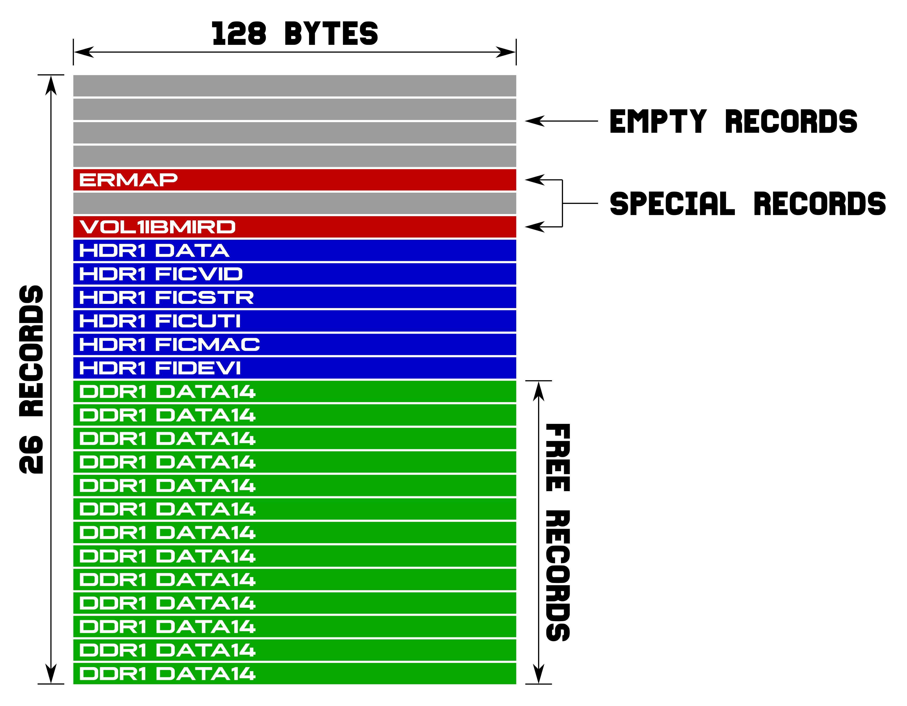
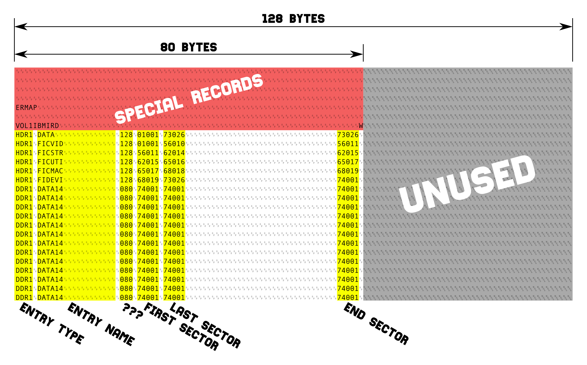
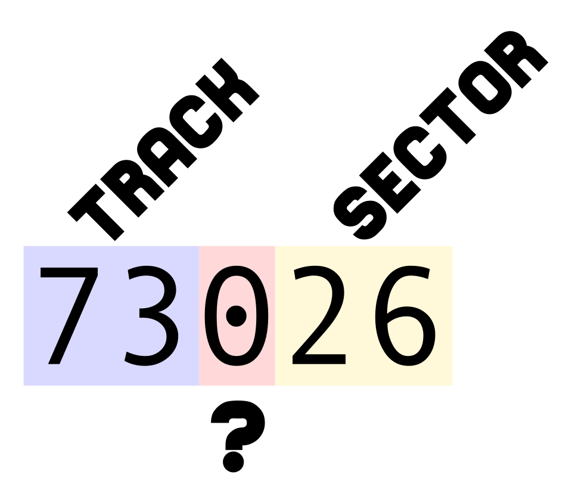
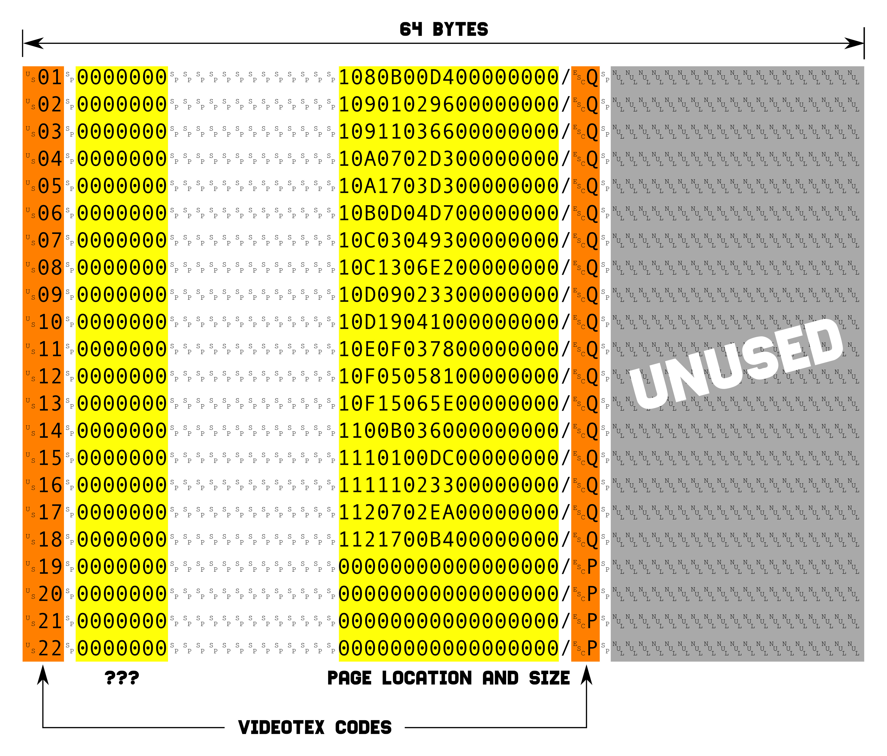
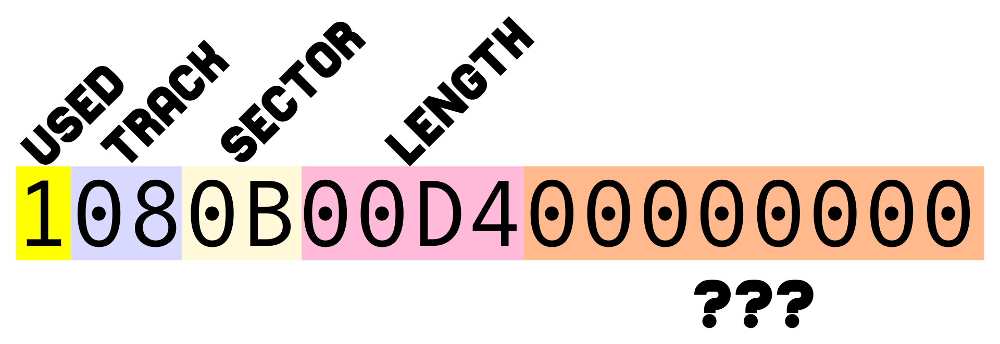

Technical notes
===============

These notes describe what I have been able to understand of the Unitel floppy
disk format. They can be inaccurate or use invalid terms.

The format seems to originate from the IBM 3740. Thus it uses the EBCDIC
encoding.

General organisation
--------------------

The floppy disk format use the following geometry:

- 1 side
- 81 tracks per side
- 26 sectors per side
- 128 bytes per sector

The floppy disk is composed of 2 parts:

- the **catalog**, which entirely occupies the first track,
- the **data**, which occupies the other tracks.

Catalog structure
-----------------

The following image shows the general organisation of a catalog.

The catalog occupies the first track and contains one record per sector. This
gives a fixed number of 26 records for the catalog:

- the first 7 records are reserved
    * 4 empty records
    * `ERMAP` special record (ERror MAP) 
    * 1 empty record
    * `VOL1IBMIRD` sepcial record
- the 19 remaining records are used to hold record sets

Standard record structure
-------------------------

Each standard record in the catalog:

- use the same format,
- designates a block of contiguous sectors on the disk,
- can overlap other blocks.

Only the first 80 characters of the record are used, the last 48 characters are
set to `NUL` (0).

Fields all have fixed length and are not optionals. A column that is not used
to hold information is set to `SP` (space).

### Entry type

The entry type field uses columns 0-3 (4 characters).

The first character has two possible values:

- **`H`** means the entry points to data,
- **`D`** means the entry is deleted or free to use.

The last 3 characters are always set to `DR1`.

### Entry name

The entry name field uses columns 5-20 (16 characters).

It's a character string padded with spaces on the right.

### Unknown field

An unknown field uses columns 22-24 (3 characters).

It contains either `128` or `080`.

### First sector

The first sector uses columns 26-30 (5 characters).

The digits are plain text digits.

Sector addresses are formatted like this:

- first 2 digits are the track number (first track is 0)
- 3rd digit is unknown (maybe the side number or an extended sector number)
- last 2 digits are the sector number (first sector is 1)

### Last sector

The last sector uses columns 32-36 (5 characters).

It is the actual end of data of the catalog entry.

See first sector description for more information.

### End sector

The end sector uses columns 74-78 (5 characters).

This is the end of the space reserved to the catalog entry.

See first sector description for more information.

Unitel files
------------

Unitel uses five records of the catalog.

- `DATA`, containing all the following data,
- `FICVID`, the video pages,
- `FICSTR`, unknown usage,
- `FICUTI`: management masks (Videotex pages used for the backoffice),
- `FICMAC`: pages location,
- `FIDEVI`: unknown usage.

The management masks hold space for exactly 100 Videotex pages.

Getting information from within these blocks is tricky since they mix
Videotex codes (for presentation) and actual information.

`FICVID` block
--------------

The `FICVID` block contains all the user Videotex pages aligned on a sector
boundary (128 bytes).

This block does not hold Videotex pages lengths. It is therefore inefficient to
directly extract pages from this block because it can contain garbage characters
generated by successive edits of the page.

The pages are not null terminated.

`FICMAC` block
--------------

The `FICMAC` block contains information on all the Videotex pages stored on
the disk.

The records containing Videotex page locations and lengths are 64 bytes wide.

### Retrieving informations

Here are the interesting offsets from the start of the `FICMAC` block to the
100 pages locations and lengths:

- 0x380, 12 records,
- 0x900, 22 records,
- 0x1100, 22 records,
- 0x1900, 22 records,
- 0x2100, 22 records.

### Pages locations and lengths structure

The page location and length field uses columns 24-40 (17 characters)

Contrary to the catalog, track, sector and length are hexadecimal encoded.
